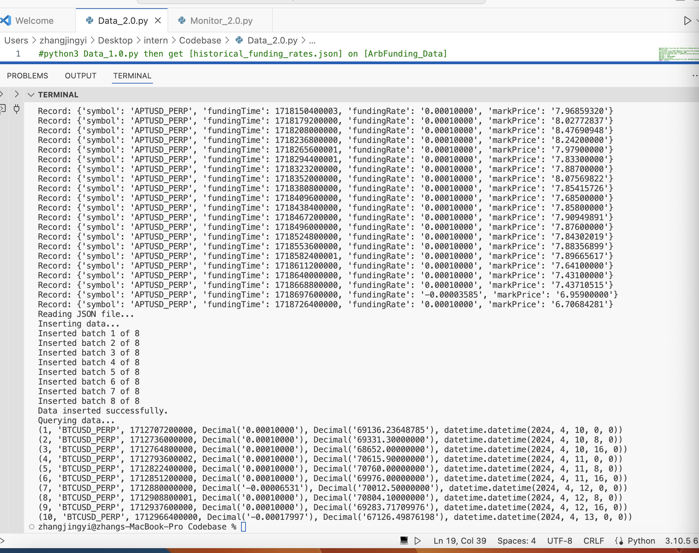
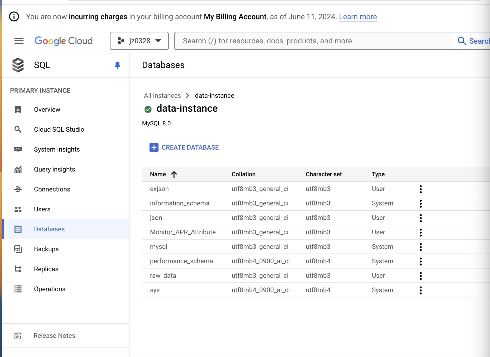

# tasks done 
- 1.Task 1: Automatically upload the [historical_funding_rates.json] file in [[ArbFunding_Data]] generated by data2.0.py to Google Cloud SQL. 
- 2.Task 2: Modify monitor2.0.py to read historical_funding_rates.json from Google Cloud SQL instead of locally.
- 3.Task 3: Automatically upload the monitor_latest.csv file from nginx_results directory generated by monitor2.0.py to Google Cloud.
- 1.任务 1：自动上传由 data1.0.py 生成的 historical_funding_rates.json 文件到 Google Cloud SQL - 已完成。
- 2.任务 2：修改 monitor1.0.py 以从 Google Cloud SQL 读取 historical_funding_rates.json，而不是从本地读取 - 已完成。
- 3.任务 3：自动上传 monitor1.0.py 生成的 [nginx_results] 目录中的 [monitor_latest.csv] 文件到 Google Cloud - 已完成
# insturction of code:
- 0. create a folder for this project, is this big folder, create [codebase] folder, [ArbFunding_Data] folder [nginx_results]folder and [Portfolio]folder
- 0.5 download [service-account-file.json] [Data_2.0.py] [ Monitor_2.0.py] [Data_1.0.py] and [ Monitor_1.0.py] and put them into [codebase] folder
- 1. run [Data_2.0.py] to get [historical_funding_rates.json]  on local [ArbFunding_Data] folder and google clouud sql
- 2. run[ Monitor_2.0.py] to get [monitor_latest.csv ] on local[nginx_results]folder and google clouud sql
- 3. [Data_1.0.py] and [ Monitor_1.0.py] are original code before I edit, u can also find them in https://drive.google.com/drive/folders/1o5rnYyq48qur7RJjP-Jn6Daza9CWmloU
# detail information of google cloud sql
- [historical_funding_rates.json] is upload to

  instance_connection_name = 'jz0328:us-central1:data-instance'
  
  db_user = 'root'

  db_pass = 'KKbhast0088!'

  db_name = 'raw_data'

- [monitor_latest.csv] is upload to

  instance_connection_name = 'jz0328:us-central1:data-instance'
  
  db_user = 'root'

  db_pass = 'KKbhast0088!'

  db_name = 'Monitor_APR_Attribute'
# demo
- here is what terminal looks like after running Data_2.0.py
  [Logo](https://github.com/jyz0328/intern-tasks/blob/main/data2running.png)
  
 here is what terminal looks like after running Monitor_2.0.py
- here is the locations of data in GOOGLE CLOUD SQL, again [historical_funding_rates.json] is in 'raw_data' while [monitor_latest.csv] is in 'Monitor_APR_Attribute'
  
